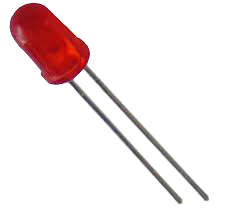
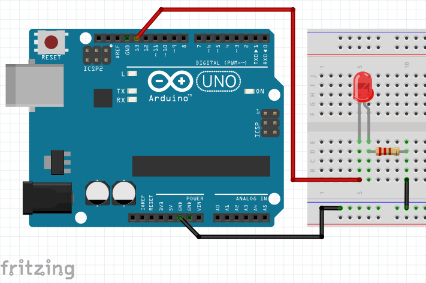
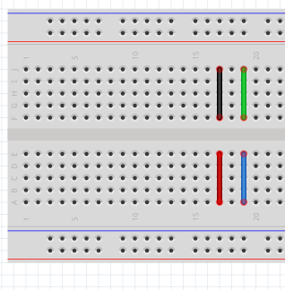

# 03 - El nostre primer circuit

Q.Serrano - <quique.srrn@gmail.com> - QODE66

## Finalitat

Tractarem de fixar algunes idees bàsiques sobre electrònica. Després muntarem un circuit amb LED i resistència. Amb tot açò aprendrem a treballar amb la protoboard. Per finalitzar farem la instal·lació del blinking LED en la protoboard.

## Material

|                               Imatge                               | Descripció                                                           |
| :----------------------------------------------------------------: | :------------------------------------------------------------------- |
|       | Arduino Uno o compatible amb S4A i amb el firmware per S4A carregat. |
|  | Una protoboard                                                       |
|      | Cables de connexió                                                   |
|         | Un díode led                                                         |
|    | Una resistència de 330 Ohms                                          |

## Algunes idees bàsiques d’electrònica

La electricitat és la manifestació del moviment de pas de càrregues elèctriques. Nosaltres considerarem que la càrrega elèctrica flueix del pol positiu al negatiu i d’aquesta energia podem treure un rendiment.

¿Què caracteritza l’electricitat?

- El voltatge (V), la facilitat que te l’electricitat per anar del positiu al negatiu
- La intensitat (I), que és la quantitat d’electricitat que flueix en un moment donat.
- La resistència \(R), és el que s’oposa al pas de l’electricitat.

El voltatge se mesura en Volts, la intensitat en Amperes i la resistència en Ohms.
En el món d’arduino, el voltatge es quasi sempre 5V, que és la tensió a que funciona. És molt important respectar el valor de la tensió d’alimentació de la placa, perquè si és menor no funcionara adequadament i si és major podem cremar-la.

## El nostre primer circuit electrònic

En la lliçó anterior vam programar el LED connectat al pin 13 del nostre Arduino. Ara duplicarem aquest circuit en l'exterior. El seu esquema elèctric seria així:

Veiem a l'esquerra el símbol del díode LED que és emissor de llum i per això té aqueixes fletxes sortints per a indicar-ho (LED ve de l'anglès Light Emitting Diode, o díode emissor de llum).

La resistència es representa per aqueix segon símbol indicant un nom R1 i el seu valor 220Ω.
Al seu costat veiem a l'esquerra les lletres GND per a indicar que és el negatiu. Té molts noms: Massa, El símbol "-", Terra (Encara que no és el mateix), Ground, Negatiu, càtode.

Finalment a la dreta el símbol de +5V indica l'extrem de tensió positiva o positiu i a vegades es representa com Vcc.

Les línies rectes i negres indiquen connexió elèctrica mitjançant cables conductors.

### Díode LED

- Un díode, és un component electrònic que només permet passar el corrent en una adreça. En la direcció del positiu al negatiu (la part ampla del triangle) al negatiu, la punta del triangle (que indica la direcció).
- Per a indicar quin de les potes d'un díode LED és el positiu, aquest sol ser de major longitud.
- Si es connecta al revés, tallarà el flux de corrent molt eficaçment i no s'il·luminarà en absolut.
- Les resistències en canvi no diferencien un extrems de l'altre, i per això diem que no tenen polaritat.

### Conexionat

És important entendre els esquemes electrònics perquè permeten comprendre amb rapidesa qualsevol circuit. Val la pena dedicar-li una mica d'esforç perquè són el llenguatge de l'electrònica.

Una vegada comprés l'esquema elèctric del circuit, vegem la connexió en la protoboard:
Aquest esquema segueix una pauta de marcar els cables que van a positiu en roig i els que van a GND en negre. Us recomanem encaridament que seguiu aquesta norma en la pràctica perquè ajuda a identificar possibles problemes i evita errors.

- La protoboard uneix els punts horitzontals de la línia blava entre si i els horitzontals de damunt de la línia roja entre si, (se'n diu raïls), però no connecta el raïl roig positiu amb el raïl negre negatiu.
- En algunes protoboards aquests raïls arriben només fins a la meitat d'ella. L'altra meitat és un altre raïl diferent. En aqueix cas les línies roja i blava estan dividides en dues en la meitat de la línia.
- Al seu torn existeixen dues zones de línies verticals en la protoboard. Aquestes línies verticals estan unides entre si internament, per a facilitar la connexió dels components, però no s'uneixen les línies paral·leles, ni tampoc a l'altra meitat separada pel canal central.

En la imatge les diferents línies de colors representen alguns exemples de com estan units internament els punts de connexió. Tots els punts davall d'una línia d'un mateix color són un únic punt quant a connexió elèctrica.

Les claus per a muntar el circuit amb èxit, són:

- Connectem el pin 13 de Arduino. a la línia roja de la protoboard.
- Connectem el GND de Arduino. a la línia blava de la protoboard.
- Usem el raïl positiu (els pins de la línia roja) per a connectar a la resistència.
- L'altre extrem de la resistència es connecta al positiu del LED perquè estan en la mateixa vertical de la protoboard (i aquesta els connecta elèctricament).
- El positiu del LED està clarament marcat com de major longitud mitjançant un xicotet angle prop de la base.
- Un díode LED quasi no presenta resistència pròpia, per la qual cosa sempre ha d'usar-se una resistència addicional que limite el pas de corrent, i evite que es creme. (Una resistència entre 220 i 3300 Ω sol ser adequada).
- El circuit es tanca amb un cable des del negatiu del LED al raïl de GND.
- Quan el nostre programa pose un valor de HIGH (5V) en el pin 13, permetrà el flux de corrent pel circuit il·luminant el LED. Amb LOW senzillament el circuit estarà apagat, sense tensió.

Podem ara executar el programa que vam fer en la lliçó 2, seguint el procediment que definim allí, i veurem com aquesta vegada, a més del LED propi de Arduino., el nostre LED exterior parpelleja seguint el mateix cicle d'encesa i apagat.

## Conceptes importants

- Hem vist alguns conceptes bàsics d'electrònica: la llei d'Ohm, que relaciona la tensió la resistència.
- Hem identificat dos components bàsics en electrònica, resistències i els díodes.
- Vam aprendre a desxifrar els primers esquemes electrònics.
- Hem muntat el nostre primer circuit amb aquests components.

## Veure també

- [02 - El nostre primer programa Scratch](S4A-02.md)
- [04 - Execució d'un programa en pantalla](S4A-04.md)
- [Index](Index.md)
- [README](README.md)
